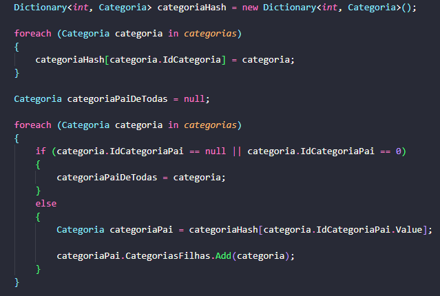

# Exemplo do uso de um árvore hierárquica para organizar as categorias de produtos de forma hierárquica

### ` JSON das categorias`

    

 

### ` Montagem da árvore hierárquica em C# `

    

 

### ` 💡 Topics Covered`
* Dapper
* .NET 7
* SQL Server
* CTE Recursivo
* Árvore hierárquica
* Estrutura de dados

